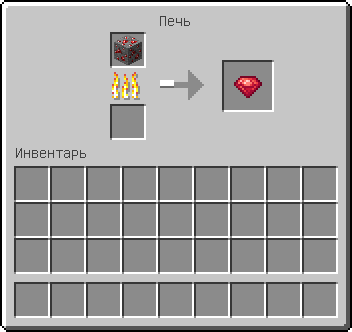

description: Добавление рецепта для предмета/блока.

# Добавление рецепта

Существует три вида рецептов, доступные для регистрации. Форменный, бесформенный и рецепт плавки. В данной статье вы
научитесь добавлять все три типа рецептов. Если вас интересует рецепт для варочной стойки, то мы рекомендуем вам
использовать событие `PotionBrewEvent`.

!!! danger "Важно!"
    Добавлять рецепты необходимо после регистрации предметов/блоков, а если вы хотите добавить рецепт с предметами
    из других модов, то необходимо указывать зависимость на мод в аннотации `@Mod` и проводить регистрацию рецепта в
    методе с `FMLPostInitializationEvent` или `FMLLoadCompleteEvent` параметром.

## Форменный рецепт

Форменный рецепт - это рецепт в котором учитывается положение предметов в слотах крафта. Такими рецептами являются:
стол зачарований, кирка, меч и т.п. Для добавления такого рецепта воспользуемся методом
`GameRegistry#addShapedRecipe(ItemStack, Object[])`.

```java title="Пример форменного рецепта"
package ru.mcmodding.tutorial.common.handler;

import cpw.mods.fml.common.registry.GameRegistry;
import net.minecraft.init.Items;
import net.minecraft.item.ItemStack;

public class ModRecipes {
    public static void registerRecipes() {
        GameRegistry.addShapedRecipe(new ItemStack(ModItems.RUBY_SWORD),
                " R ", " R ", " S ",
                'R', ModItems.RUBY,
                'S', Items.stick);
    }
}
```

Рассмотрим `GameRegistry#addShapedRecipe(ItemStack, Object[])` из примера более подробно.

Первым параметром идёт результат крафта, в нашем случае это стек предмета "Рубиновый меч", далее вторым идёт массив
объектов, где первый объект это три слота сверху, вторым объектом идут три слота посередине, третьим объектом идут 
три нижних слота сетки крафта(общее название - шаблон крафта). Принцип по которому строится шаблон довольно простой. 
Пустой символ(пробел) эквивалентен пустому слоту, буквы в теории, должны обозначать предмет. В нашем случае
R обозначает Ruby(рубин), а S - stick(палка). Вы можете указывать в `Object[]` блоки(`Block`), предметы(`Item`) и 
стек предмета(`ItemStack`).

Затем переходим к символам шаблонов. Чтобы менеджер крафтов мог распознать символы в шаблоне, как предметы, мы добавляем
следующим(пятым параметром) символ 'R', а потом шестым параметром указывает сам предмет, в нашем случае мы говорим,
что символ 'R' это `ModItems.RUBY`, аналогично с другими символами.

Зарегистрируем наш рецепт.

```java hl_lines="11"
package ru.mcmodding.tutorial.common;

import cpw.mods.fml.common.event.FMLPostInitializationEvent;
import ru.mcmodding.tutorial.common.handler.*;

public class CommonProxy {
    
    public void postInit(FMLPostInitializationEvent event) {
        // ...
        
        ModRecipes.registerRecipes();
    }
}
```

Теперь можете зайти в игру и проверить добавленный рецепт.


## Бесформенный рецепт

Бесформенный рецепт - это рецепт в котором не учитывается расположение предметов в слотах крафта. Такими рецептами являются:
огниво, око эндера, книга и т.п. Для добавления такого рецепта воспользуемся методом
`GameRegistry#addShapelessRecipe(ItemStack, Object[])` и добавим рецепт к воздушным шарикам, а их у нас 16 шт, поэтому
добавим добавление рецепта через цикл с указанием `itemDamage`.

```java title="Пример бесформенного рецепта"
package ru.mcmodding.tutorial.common.handler;

import cpw.mods.fml.common.registry.GameRegistry;
import net.minecraft.init.Blocks;
import net.minecraft.init.Items;
import net.minecraft.item.ItemStack;

public class ModRecipes {
    public static void registerRecipes() {
        // ...

        for (int damage = 0; damage < 15; damage++) {
            GameRegistry.addShapelessRecipe(new ItemStack(ModItems.BALLOON, 1, damage), new ItemStack(Blocks.wool, 1, ~damage & 15), Items.string);
        }
    }
}
```

!!! tip "Подсказка"
    Чтобы правильно получить блок шерсти по `itemDamage` от 0 до 15, 
    необходимо `itemDamage`(в нашем случае `damage`) инвертировать, как показано в примере.

Первым параметром идёт результат крафта, в нашем случае это стек предмета "Воздушный шарик". Вторым параметром мы указываем
массив объектов, где вы можете задать блоки(`Block`), предметы(`Item`) и стек предмета(`ItemStack`) в произвольном порядке,
без чёткой привязки к позиции в сетке крафта.


## Плавление в печи

Для добавления рецепта в печь используется три метода:

1. `GameRegistry#addSmelting(Block, ItemStack, Float)`
2. `GameRegistry#addSmelting(Item, ItemStack, Float)`
3. `GameRegistry#addSmelting(ItemStack, ItemStack, Float)`

Где первым параметром является предмет/блок для плавки, вторым результат плавки, а третьим кол-во опыта получаемого при
плавлении предмета/блок. Добавим возможность плавить рубиновую руду в рубины.

```java title="Пример рецепта плавления"
package ru.mcmodding.tutorial.common.handler;

import cpw.mods.fml.common.registry.GameRegistry;
import net.minecraft.init.Blocks;
import net.minecraft.item.ItemStack;

public class ModRecipes {
    public static void registerRecipes() {
        // ...

        GameRegistry.addSmelting(ModBlocks.RUBY_ORE, new ItemStack(ModItems.RUBY), 5F);
    }
}
```




## Использованием предметов из словаря руд в рецептах

!!! danger "Важно"
    Данный раздел рассчитан на разработчиков, прочитавших статью [словарь руд](../ore-dictionary)!

Ранее мы создавали рецепты форменные и бесформенные, но стандартная реализация не позволяет использовать словарь руд.
Для решения этой проблемы были написаны такие классы как `ShapedOreRecipe` и `ShapelessOreRecipe`. Регистрируются они
с помощью метода `GameRegistry#addRecipe(IRecipe)`.

!!! warning "Важно"
    Регистрация рецептов использующих предметы из словаря руд, необходимо производить после регистрации предмета
    в словаре руд.

```java title="Пример рецепта с предметами из словаря руд"
package ru.mcmodding.tutorial.common.handler;

import cpw.mods.fml.common.registry.GameRegistry;
import net.minecraft.item.ItemStack;
import net.minecraftforge.oredict.ShapedOreRecipe;
import net.minecraftforge.oredict.ShapelessOreRecipe;

public class ModRecipes {
    public static void registerRecipes() {
        // ...

        GameRegistry.addRecipe(new ShapedOreRecipe(new ItemStack(ModItems.RUBY_SWORD),
                " R ", " R ", " S ",
                'R', "gemRuby",
                'S', "stickWood"));
        GameRegistry.addRecipe(new ShapelessOreRecipe(new ItemStack(ModItems.RING), "gemRuby", "ingotGold"));
    }
}
```
